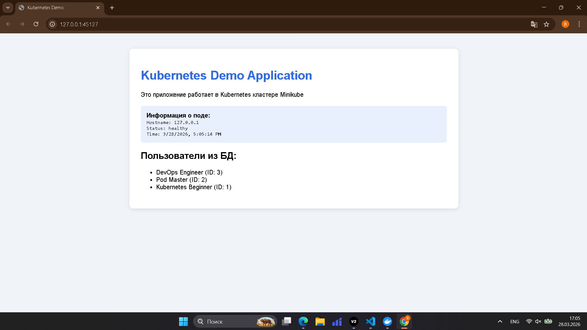
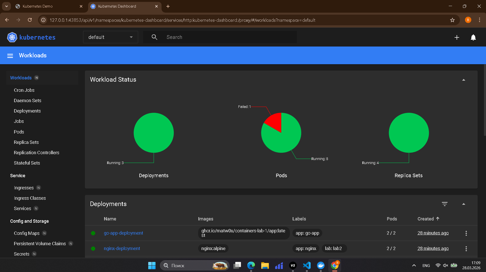
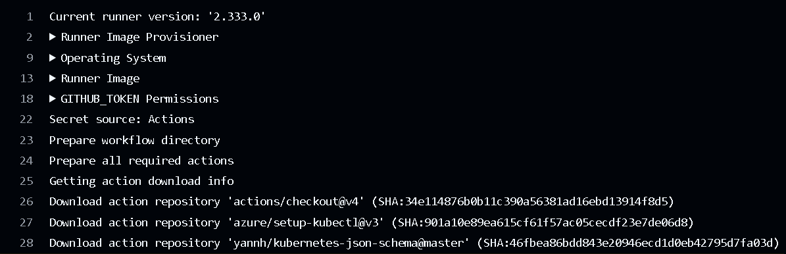

# Отчет по практической работе №2
### Студент: Крашенинников Матвей Вячеславович
### Группа: БСБО-16-23
### Дата выполнения: 28.03.2026
### 1. Информация о кластере
#### 1.1 Статус Minikube
```shell
twox@Matvey:~/containers-lab-1$ minikube status
minikube
type: Control Plane
host: Running
kubelet: Running
apiserver: Running
kubeconfig: Configured
```
#### 1.2 Узлы кластера
```shell
twox@Matvey:~/containers-lab-1$ kubectl get nodes -o wide
NAME       STATUS   ROLES           AGE   VERSION   INTERNAL-IP    EXTERNAL-IP   OS-IMAGE                         KERNEL-VERSION                       CONTAINER-RUNTIME
minikube   Ready    control-plane   46m   v1.35.1   192.168.49.2   <none>        Debian GNU/Linux 12 (bookworm)   5.15.167.4-microsoft-standard-WSL2   docker://29.2.1
```
### 2. Созданные ресурсы
#### 2.1 Pods
```shell
twox@Matvey:~/containers-lab-1$ kubectl get all
NAME                                      READY   STATUS             RESTARTS      AGE
pod/go-app-bad-pod                        0/1     CrashLoopBackOff   9 (99s ago)   23m
pod/go-app-deployment-58b459849f-9jn9n    1/1     Running            0             26m
pod/go-app-deployment-58b459849f-dlwvl    1/1     Running            0             25m
pod/nginx-deployment-6f7bb479f4-j4kmj     1/1     Running            0             10m
pod/nginx-deployment-6f7bb479f4-xhxrc     1/1     Running            0             10m
pod/postgres-deployment-75fc8ccd7-szr6j   1/1     Running            0             28m

NAME                       TYPE        CLUSTER-IP       EXTERNAL-IP   PORT(S)        AGE
service/go-app-service     ClusterIP   10.100.251.207   <none>        8080/TCP       34m
service/kubernetes         ClusterIP   10.96.0.1        <none>        443/TCP        47m
service/nginx-service      NodePort    10.111.186.76    <none>        80:30080/TCP   34m
service/postgres-service   ClusterIP   10.101.201.94    <none>        5432/TCP       34m

NAME                                  READY   UP-TO-DATE   AVAILABLE   AGE
deployment.apps/go-app-deployment     2/2     2            2           34m
deployment.apps/nginx-deployment      2/2     2            2           34m
deployment.apps/postgres-deployment   1/1     1            1           34m

NAME                                            DESIRED   CURRENT   READY   AGE
replicaset.apps/go-app-deployment-58b459849f    2         2         2       26m
replicaset.apps/go-app-deployment-b955f5785     0         0         0       34m
replicaset.apps/nginx-deployment-6f7bb479f4     2         2         2       34m
replicaset.apps/postgres-deployment-75fc8ccd7   1         1         1       34m
```
#### 2.2 Deployments
```
kubectl get deployments
NAME                  READY   UP-TO-DATE   AVAILABLE   AGE
go-app-deployment     2/2     2            2           2d18h
nginx-deployment      2/2     2            2           2d18h
postgres-deployment   3/3     3            3           2d18h
```
#### 2.3 Services
```
kubectl get services
NAME               TYPE        CLUSTER-IP       EXTERNAL-IP   PORT(S)        AGE
go-app-service     ClusterIP   10.108.226.243   <none>        8081/TCP       2d18h
kubernetes         ClusterIP   10.96.0.1        <none>        443/TCP        3d18h
nginx-service      NodePort    10.97.126.206    <none>        80:30080/TCP   2d18h
postgres-service   ClusterIP   10.97.127.28     <none>        5432/TCP       2d18h
```
### 3. Скриншоты работы приложения
#### 3.1 Главная страница

#### 3.2 Дашборд Kubernetes

### 4. Эксперименты с масштабированием
#### 4.1 Масштабирование до 5 реплик
```shell
twox@Matvey:~/containers-lab-1$ kubectl scale deployment go-app-deployment --replicas=5
deployment.apps/go-app-deployment scaled
twox@Matvey:~/containers-lab-1$ kubectl get pods -l app=go-app
NAME                                 READY   STATUS    RESTARTS   AGE
go-app-deployment-58b459849f-9jn9n   1/1     Running   0          28m
go-app-deployment-58b459849f-dlwvl   1/1     Running   0          28m
go-app-deployment-58b459849f-h626h   1/1     Running   0          20s
go-app-deployment-58b459849f-mwtnh   1/1     Running   0          20s
go-app-deployment-58b459849f-s8qgz   1/1     Running   0          20s
```
#### 4.2 Проверка распределения нагрузки
\`\`\`
Сделано: в кластере отправлено 50 запросов на `http://nginx-service/api/health` (curl из временного pod).

Количество обработанных запросов `GET /api/health` по nginx pod’ам (интервал 21:02):
nginx-deployment-846d7bc598-5cjlj: 10
nginx-deployment-846d7bc598-6n96l:  9
nginx-deployment-846d7bc598-csdq8:  15
nginx-deployment-846d7bc598-dv99h:  10
nginx-deployment-846d7bc598-rt6lp:  6

Примеры строк из access-лога nginx на 21:02 (GET /api/health):
nginx-deployment-846d7bc598-5cjlj:
10.244.0.95 - - [26/Mar/2026:21:02:19 +0000] "GET /api/health HTTP/1.1" 200 21 "-" "curl/8.7.1"
nginx-deployment-846d7bc598-6n96l:
10.244.0.95 - - [26/Mar/2026:21:02:19 +0000] "GET /api/health HTTP/1.1" 200 21 "-" "curl/8.7.1"
nginx-deployment-846d7bc598-csdq8:
10.244.0.95 - - [26/Mar/2026:21:02:19 +0000] "GET /api/health HTTP/1.1" 200 21 "-" "curl/8.7.1"
nginx-deployment-846d7bc598-dv99h:
10.244.0.95 - - [26/Mar/2026:21:02:19 +0000] "GET /api/health HTTP/1.1" 200 21 "-" "curl/8.7.1"
nginx-deployment-846d7bc598-rt6lp:
10.244.0.95 - - [26/Mar/2026:21:02:19 +0000] "GET /api/health HTTP/1.1" 200 21 "-" "curl/8.7.1"
\`\`\`
### 5. GitHub Actions
#### 5.1 Успешная валидация манифестов

### 6. Ответы на контрольные вопросы
1. В чем разница между Pod и Deployment?
```
Pod - минимальная сущность k8s, которая запускается в единственном экземпляре с одни или несколькоми контейнерами внутри. 
Deployment - это констроллер, который управляет жизненным циклом репликов подов. В нем описаывается желаемые ресурсы и их количество, чего нет в api pod.
```
2. Для чего нужен Service типа ClusterIP?
```
Для предоставления стабильного ip на уровне кластера k8s, без возможности подключения из вне.
```
3. Как ReplicaSet обеспечивает самовосстановление?
```
Манифесты k8s - декларативный код, то есть мы просим некий ожидания, k8s реализовывает их. В ReplicaSet указываются количество реплик, желаемые ресурсы, необходимый образ. Если одно из условий не выполняются, то ReplicaSet пытается прийти к этому результату. Если под упадется, он не будет удолетворять условию, и ReplicaSet пересоздаст упавший под.
```
4. Что произойдет с приложением, если удалить под PostgreSQL?
```
Если не настроены StatefulSet, то у нас не оснанутся данные приложения и самовостановится под. Если он есть, то под восстановится и временно нагрузку возмут другие поды, если настроены реплики. 
```
### 7. Выводы
Развернул Minikube и на практике разобрался с основными сущностями Kubernetes: Pod, Deployment, ReplicaSet и Service. В ходе лабораторной развернул приложение с nginx в виде Deployment, проверил доступность через Service и убедился, что масштабирование увеличивает число работающих pod’ов и распределяет нагрузку. Также закрепил работу с манифестами и GitHub Actions в рамках контроля корректности Kubernetes-развёртываний.