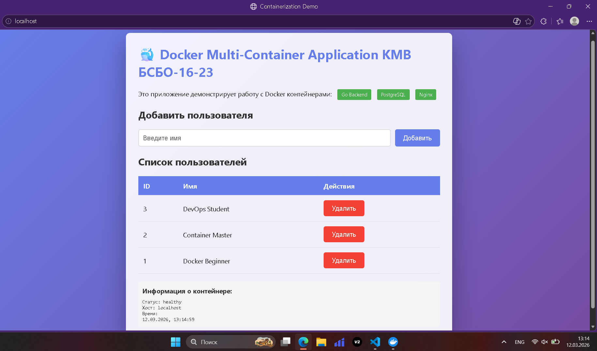
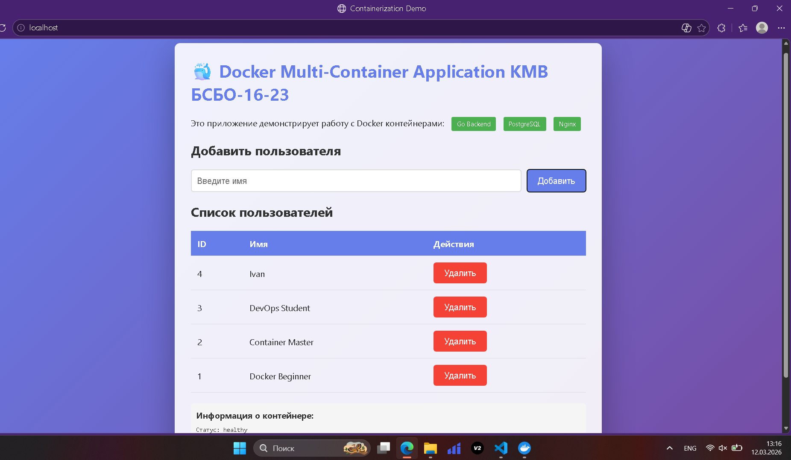
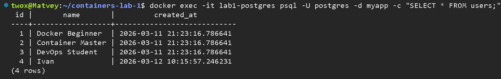
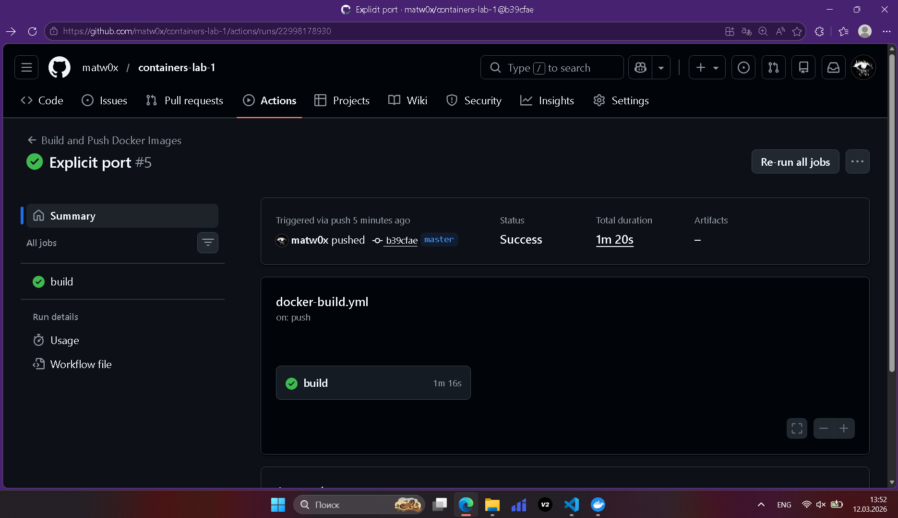
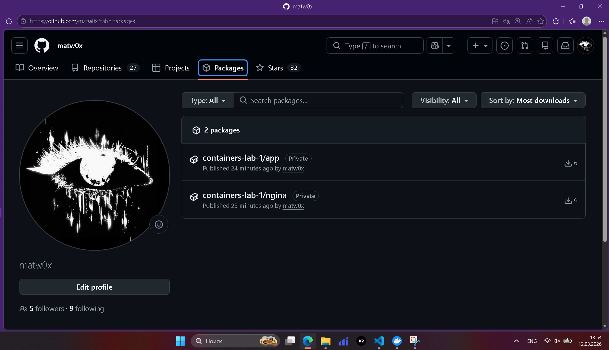

# Отчет по практической работе №1
## Студент: Крашенинников Матвей Вячеславович
## Группа: [БСБО-16-23]
## Дата выполнения: 12.03.2026

### 1. Выполненные команды Docker
#### 1.1 Работа с образами
```shell
twox@Matvey:~/containers-lab-1$ docker pull postgres:15-alpine
docker pull golang:1.21-alpine
15-alpine: Pulling from library/postgres
589002ba0eae: Pull complete
aa104f8e5799: Pull complete
ac1ff2379be8: Pull complete
8c9e2aa22b4c: Pull complete
765f80b9a483: Pull complete
a27cb555d458: Pull complete
610258b635a8: Pull complete
2a9c4fd442cb: Pull complete
9f6d6f38d9d3: Pull complete
b53228f7876a: Pull complete
34c88efd36aa: Pull complete
Digest: sha256:fceb6f86328c36f2438fae3b851b0cc57c4a7e69a58c866d9ce24281f2cf0c9c
Status: Downloaded newer image for postgres:15-alpine
docker.io/library/postgres:15-alpine
1.21-alpine: Pulling from library/golang
c6a83fedfae6: Pull complete
41db7493d1c6: Pull complete
54bf7053e2d9: Pull complete
4579008f8500: Pull complete
4f4fb700ef54: Pull complete
Digest: sha256:2414035b086e3c42b99654c8b26e6f5b1b1598080d65fd03c7f499552ff4dc94
Status: Downloaded newer image for golang:1.21-alpine
docker.io/library/golang:1.21-alpine
```
#### 1.2 Работа с контейнерами
```shell
twox@Matvey:~/containers-lab-1$ docker exec -it pg-test psql -U postgres -c "SELECT version();"
                                         version
------------------------------------------------------------------------------------------
 PostgreSQL 15.17 on x86_64-pc-linux-musl, compiled by gcc (Alpine 15.2.0) 15.2.0, 64-bit
(1 row)
```
### 1.3 Работа с томами и сетями
```shell
twox@Matvey:~/containers-lab-1$ docker exec nginx-net ping -c 3 pg-net
PING pg-net (172.18.0.2): 56 data bytes
64 bytes from 172.18.0.2: seq=0 ttl=64 time=0.202 ms
64 bytes from 172.18.0.2: seq=1 ttl=64 time=0.139 ms
64 bytes from 172.18.0.2: seq=2 ttl=64 time=0.151 ms

--- pg-net ping statistics ---
3 packets transmitted, 3 packets received, 0% packet loss
round-trip min/avg/max = 0.139/0.164/0.202 ms
```

### 2. Скриншоты работающего приложения
#### 2.1 Главная страница

#### 2.2 Добавление пользователя

#### 2.3 Список пользователей в БД


### 3. GitHub Actions
#### 3.1 Успешный запуск workflow


#### 3.2 Опубликованные образы в GHCR


### 4. Выводы 
Познакомился с основами Docker и написанием многостадийных Dockerfile. Успешно настроил CI/CD пайплайн в GitHub Actions для автоматической сборки и публикации образов в GHCR. Столкнулся с ошибками конфигурации в методических указаниях, которые успешно разрешил путем отладки сети и параметров healthcheck.